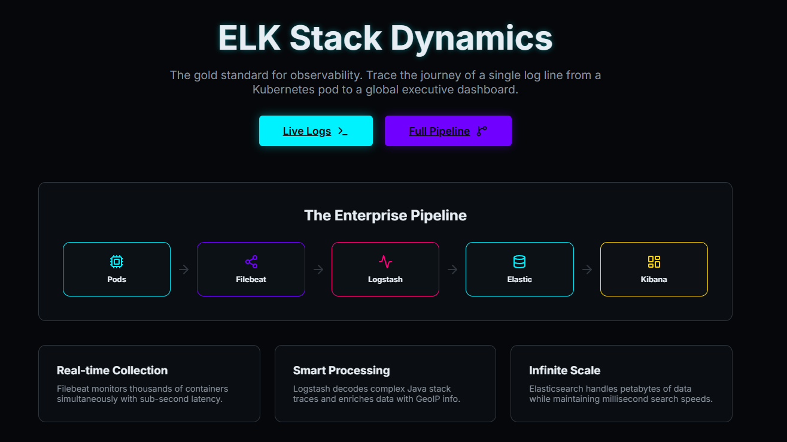

# ELK Stack Dynamics: Interactive Observability Platform

A premium, interactive web application designed to demonstrate the full lifecycle of logs in a cloud-native environment using the **ELK (Elasticsearch, Logstash, Kibana) Stack**.

Directed by **Divesh Jadhwani**

Developed by **Google Antigravity**

---

## 🚀 Overview

This project serves as an educational tool to visualize how logs travel from a **Kubernetes Cluster**, through **Filebeat** and **Logstash**, into **Elasticsearch**, and finally onto a **Kibana** dashboard.

### Main Application : [TRY NOW](https://elkdemo.netlify.app/)



---

## ✨ Key Features

- **Live Log Stream**: Real-time simulation of multiple Kubernetes Pods emitting logs.
- **End-to-End Pipeline**: A step-by-step visual walkthrough of data transformation and shipping.
- **Interactive Search**: A functional Elasticsearch-style index search demo.
- **Kibana Dashboard**: Real-time visualization of latency, error rates, and traffic patterns.
- **Deep-Dive Documentation**: A built-in knowledge base explaining complex DevOps concepts.

---

## 🛠️ Project Structure

- `src/pages/`: Contains the interactive components for each ELK stage.
- `documentation/`: A comprehensive guide to Kubernetes, Sharding, TLS/SSL, and more.
- `public/`: Static assets and icons.

### 

https://github.com/user-attachments/assets/16887064-a19b-49c3-869c-839fc756ce43


---

## 📖 Knowledge Base

The repository includes a dedicated `documentation` folder with detailed READMEs for:
- **Kubernetes**: Pods, Replicas, and stdout.
- **Filebeat**: Harvesting, Lumberjack, and Security.
- **Logstash**: Grok filters and Enrichment.
- **Elasticsearch**: Sharding and High Availability.
- **Kibana**: Observability metrics and Dashboards.

---

## 🔧 Installation & Setup

1. **Clone the repository**
2. **Install dependencies**
   ```bash
   npm install
   ```
3. **Run the development server**
   ```bash
   npm run dev
   ```
4. **Access the app** at `http://localhost:5173`

---

## 👨‍💻 About the Developer

**Divesh Jadhwani**  
*Operations & Web Development Enthusiast*

[](https://github.com/d-hackmt)
[](https://www.linkedin.com/in/dhackmt)

- **GitHub**: [github.com/d-hackmt](https://github.com/d-hackmt)
- **LinkedIn**: [linkedin.com/in/dhackmt](https://www.linkedin.com/in/dhackmt)

---

## 📜 License

This project is open-source and available for educational purposes.
