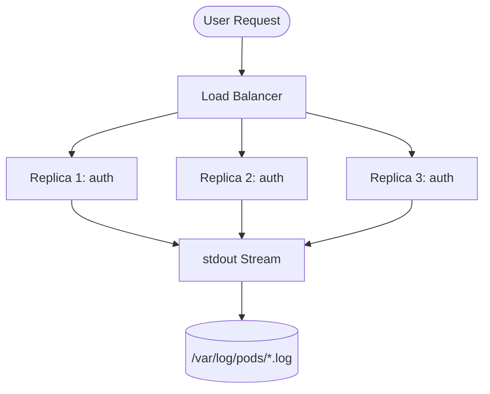

# Kubernetes Concepts: The Log Source

In our demonstration, the journey starts within a **Kubernetes (K8s) Cluster**. Here are the core concepts explained:

## 1. What is a Pod?
A **Pod** is the smallest execution unit in Kubernetes. Think of it as a wrapper around one or more containers (usually Docker containers).
- **In our demo**: We simulate 3 distinct services running in pods: `auth-service`, `payment-service`, and `orders-service`.
- **Why Pods?**: Pods provide an isolated environment for your code, including its own network IP and storage.

## 2. Why "3 Replicas"?
Running **Multiple Replicas** (instances) of the same service is a standard practice for **Scalability** and **High Availability (HA)**.
- **Load Balancing**: If 10,000 users visit the app, one pod might crash. With 3 replicas, K8s distributes the traffic.
- **Fault Tolerance**: If one replica fails, the other two continue to serve users while Kubernetes automatically restarts the failed one.
- **Demo Insight**: In the "Logs" page, you'll see logs from different replicas appearing in a single stream.

## 3. stdout (Standard Output)
When an application runs, it doesn't usually write to a "file.txt" directly. Instead, it prints to the terminal buffer called `stdout`.
- **How K8s handles it**: Kubernetes captures everything sent to `stdout` and `stderr` and saves it into local JSON files on the server node.
- **The Connection**: This is the "Gold Mine" that Filebeat searches for.

### The Flow Diagram

