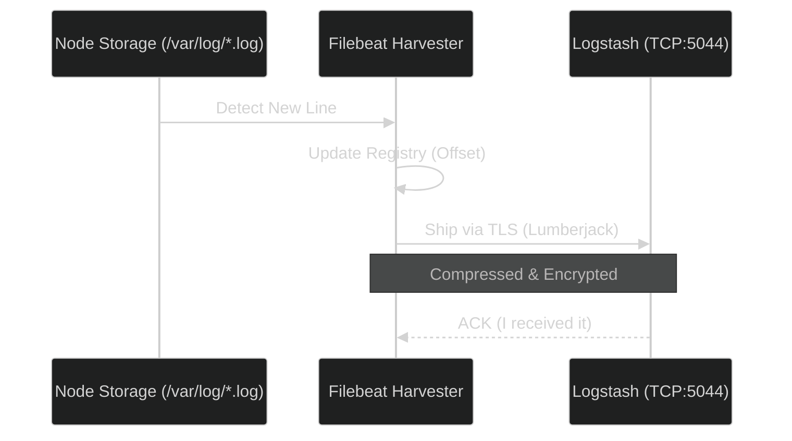

# Filebeat Logistics: The Log Shipper

Filebeat is the "Courier" of the ELK stack. It is lightweight, fast, and secure.

## 1. What is Harvesting?
Filebeat doesn't just "read" files; it **Harvests** them.
- A **Harvester** is a little process within Filebeat that opens a single log file and reads it line-by-line.
- **Persistence**: Filebeat stores a "Registry" file. If you restart Filebeat, it looks at the registry, sees it stopped at line 100, and resumes from line 101. No logs are ever lost!

## 2. What is the Lumberjack Protocol?
Filebeat uses a custom protocol called **Lumberjack** to talk to Logstash.
- **Efficiency**: It is designed to be extremely lightweight, using minimal CPU so it doesn't slow down your actual application.
- **Backpressure**: If Logstash is busy, Filebeat detects This "congestion" and slows down its delivery. This prevents the whole system from crashing during traffic spikes.

## 3. Security: TLS and SSL
Logs often contain sensitive data (IPs, user actions). We protect them using **TLS (Transport Layer Security)** and **SSL (Secure Sockets Layer)**.
- **Encryption**: Data is scrambled during transit so hackers can't "sniff" the logs on the network.
- **Certificates**: Filebeat verifies the identity of the Logstash server using a digital certificate to ensure it's not sending logs to a fake server.

### The Shipping Flow

