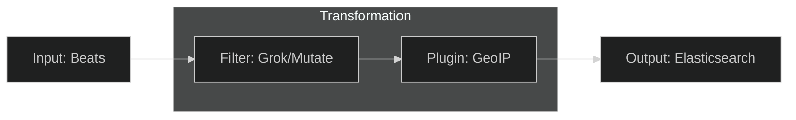

# Logstash Parsing: The Data Refinery

Once logs arrive at Logstash, they are unstructured strings. Logstash turns them into "Gold Nuggets" of data.

## 1. Grok Filters
**Grok** is the most popular way in Logstash to parse unstructured log data into something structured and queryable.
- **How it works**: It uses regular expression patterns to name parts of a sentence.
- **Example**: 
    - *Raw*: `2026-02-20 INFO [auth] login ok`
    - *Grok*: `%{TIMESTAMP_ISO8601:time} %{LOGLEVEL:level} \[%{WORD:svc}\] %{GREEDYDATA:msg}`
    - *Result*: A JSON object with fields like `time`, `level`, `svc`, and `msg`.

## 2. Enrichment & Mutation
Logstash doesn't just parse; it **Enriches**.
- **GeoIP**: It can look at an IP address and add the city/country where the user is located.
- **User-Agent**: It can look at a browser string and tell you if the user is on an iPhone or Chrome.
- **Mutate**: It can convert a string like "45" into a number `45` so you can do math (like calculating average response time).

## 3. Data Normalization
Different apps log in different formats. Java logs look different from Nginx logs. Logstash **Normalizes** them so that in your final dashboard, every log has a standard `timestamp`, `level`, and `message` field, regardless of where it came from.

### The Refinery Workflow

