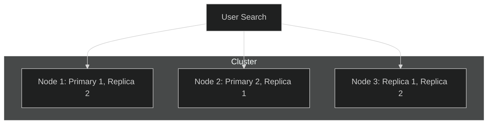

# Elasticsearch: The Search Engine Core

Elasticsearch is where your logs "live." It is a distributed database designed for speed and scale.

## 1. What is Sharding?
An index (like `logs-2026`) is too big for one server. Elasticsearch splits it into **Shards**.
- **Primary Shards**: These are the original parts of your data.
- **Why Shard?**: It allows you to search in parallel. If you have 5 shards on 5 servers, your search is 5x faster than on 1 server.

## 2. High Availability (Replication)
Elasticsearch never stores just one copy of your data. It creates **Replica Shards**.
- **The Failover**: If a server (Node A) catches fire and dies, Elasticsearch automatically promotes its replica (on Node B) to be the new Primary. Your data remains safe and reachable.

## 3. Cluster Scaling
As your company grows from 1 million to 1 billion logs, you don't need to rebuild your database. You just add more **Nodes** (Servers) to the **Cluster**.
- **Automatic Rebalancing**: Elasticsearch will see the new "empty" server and automatically move some shards over to it to balance the load.

## 4. Inverted Indexing
This is why Elasticsearch is so fast. Instead of reading every line (like grep), it creates a map:
- `Word: "Error" -> Found in Doc #1, #5, #102`
- When you search for "Error," it knows exactly where it is instantly.

### The Cluster Visual

