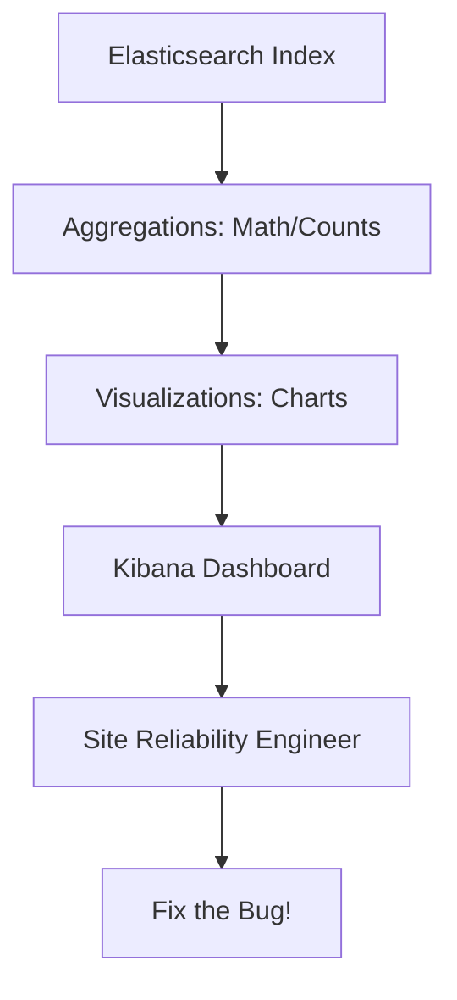

# Kibana: Visualizing Observability

Kibana is the "Control Room." It translates trillions of logs into a story that humans can understand.

## 1. Core Metrics Explained
On our dashboard, we track:
- **Total Hits**: The number of logs matching our current filters. High hits usually mean high user traffic.
- **Error Rate (5xx/4xx)**: The percentage of requests that failed. A sudden spike here triggers an "Incident" for engineers.
- **Avg Latency (ms)**: How long it takes for a user to get a response. If this goes from 100ms to 500ms, the system is "Slow."
- **Indices Count**: How many database "Drawers" we are using to store logs.

## 2. The "Discover" Table
This is our "Raw Search" view.
- **Why?**: When a dashboard shows a spike in errors, engineers use "Discover" to look at the exact log messages to find the bug.
- **Filter Bar**: You can filter by `@timestamp` to see what happened exactly 5 minutes ago.

## 3. Visualizations (Lenses)
Kibana uses "Lenses" to create charts:
- **Time Series**: A line chart showing traffic over time. Great for seeing "Peak Hours."
- **Pie Charts**: Showing the breakdown of error types (e.g., "50% are 404 Not Found").
- **Heatmaps**: Showing which geographical regions are having the most trouble.

### The Observability Logic

