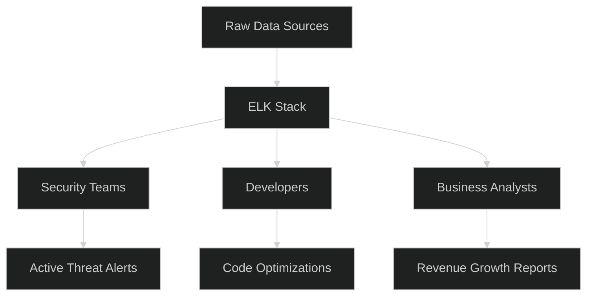

# Real-World Applications: The Power of ELK

The ELK stack is not just for searching logs; it is a versatile platform used by the world's largest companies for security, performance, and business growth.

## 1. SIEM (Security Information and Event Management)
In the security world, ELK is a powerhouse for detecting threats.
- **Threat Hunting**: Searching for "Brute Force" patterns (like 100 failed logins from one IP).
- **Compliance**: Maintaining 1-year history of audit logs for regulatory requirements.
- **Real-world example**: Detecting an XSS attack by filtering for specific script tags in web server access logs.

## 2. APM (Application Performance Monitoring)
ELK (specifically through Elastic APM) helps developers find why an app is slow.
- **Latency Tracking**: Monitoring how long every database query takes.
- **Error Grouping**: Instead of seeing 1,000 separate errors, ELK groups them into one "Root Cause" event.
- **SLA Management**: Ensuring that 99% of your users get a response in under 200ms.

## 3. Infrastructure & Cloud Monitoring
DevOps teams use ELK to watch the health of their servers and Kubernetes clusters.
- **Resource Usage**: Correlating high CPU spikes with specific application errors.
- **Network Flow**: Visualizing which microservices are talking to each other too much.

## 4. Business Intelligence & Analytics
Access logs contain valuable information about your customers.
- **User Behavior**: Tracking which features are most used.
- **Geographical Trends**: Seeing which country has the most active users via GeoIP.
- **Revenue Tracking**: Counting successful "Checkout" events to see real-time sales trends.

## 5. Centralized Search (eCommerce)
Companies use Elasticsearch as the search engine for their actual products.
- **Fuzzy Search**: Handling "Typos" (searching for "Ipohne" and finding "iPhone").
- **Faceting**: All the filters you see on Amazon (Price, Color, Brand) are powered by Elasticsearch's aggregations.

### Application Ecosystem

