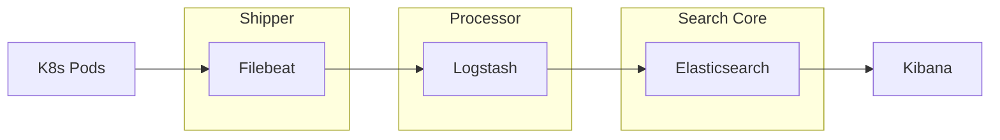

# ELK Stack Knowledge Base Index

Welcome to the comprehensive technical documentation for the ELK Stack Dynamics project. Use the links below to explore the core concepts used in this application.

## Documentation Index

### 1. [Kubernetes Concepts](01_Kubernetes_Concepts.md)
*Learn about Pods, Replicas, and how logs are generated in a cloud-native environment.*

### 2. [Filebeat Logistics](02_Filebeat_Logistics.md)
*Understand harvesting, the Lumberjack protocol, and how we secure data transit with TLS/SSL.*

### 3. [Logstash Parsing](03_Logstash_Parsing.md)
*Dive into Grok filters, data enrichment, and how we normalize unstructured logs into JSON.*

### 4. [Elasticsearch Storage](04_Elasticsearch_Storage.md)
*Explore Sharding, High Availability (Replication), Inverted Indexing, and Cluster Scaling.*

### 5. [Kibana Observability](05_Kibana_Observability.md)
*Discover how metrics like Latency and Error Rates are calculated and visualized on dashboards.*

### 6. [The Pipeline Journey](06_Pipeline_Journey.md)
*Follow a single log message through its entire lifecycle from the Pod to the Dashboard.*

### 7. [Real-World Applications](07_Real_World_Applications.md)
*Discover how ELK powers SIEM, APM, and Business Intelligence globally.*

---

## Technical Flow Summary

